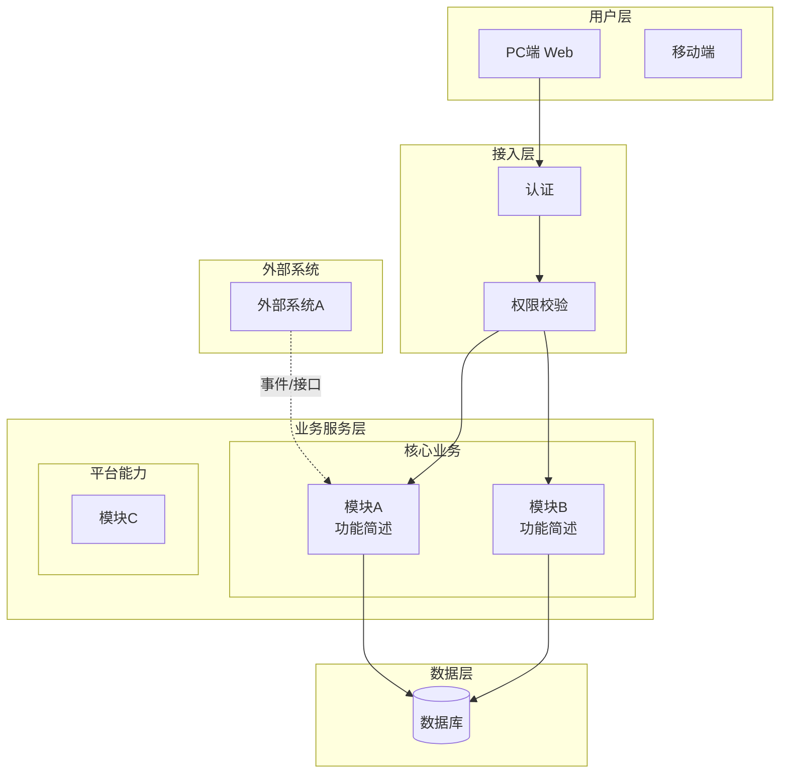
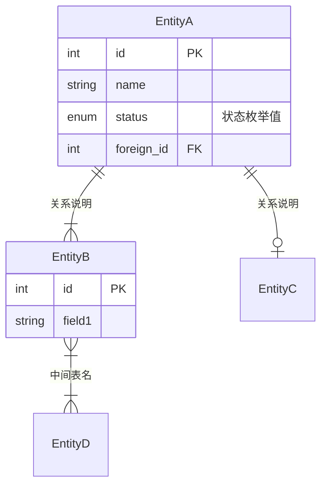
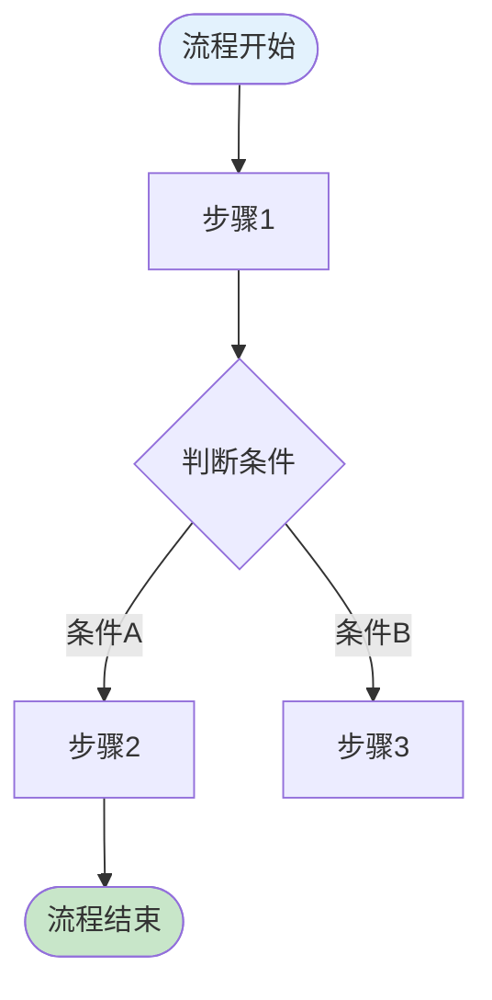
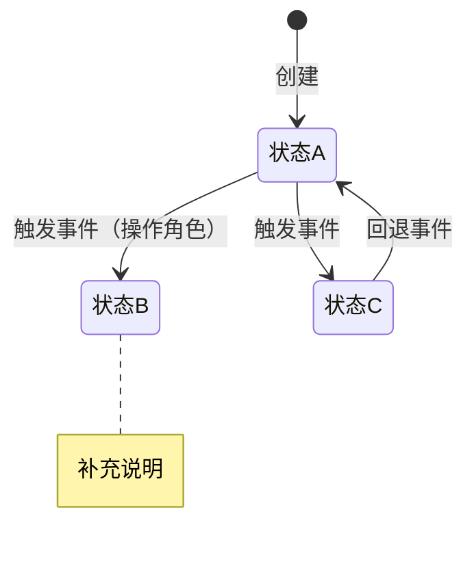

# Create-PRD 完整独立 Prompt

> 本文件是 create-prd 技能的完整独立版本，可在任何 LLM 中直接使用。

> 将本文件内容粘贴到 ChatGPT / Gemini / DeepSeek / Claude 等 LLM 中，
> 然后提供你的业务上下文，即可生成结构化 PRD。

---


============================================================

## SKILL

# create-prd

根据用户提供的业务上下文和需求背景，生成结构化的、带有初始内容的 B端 PRD 文档。

支持显式调用（如 `/create-prd`）和自动触发（当用户明确要求创建、撰写 PRD、需求文档、产品方案或企业系统设计时）。

## 输入

- 用户提供的业务上下文和需求背景（自由文本、会议纪要、简要描述等均可）
- 或通过 `$ARGUMENTS` 传入的文件路径

如有参数传入，优先作为输入源：

$ARGUMENTS

## 生成流程

严格按以下顺序执行，不可跳过或调换步骤。

### 阶段 0：理解上下文与产品定型

1. 完整阅读并理解用户提供的所有业务上下文。
2. 从用户描述中推断：
   - **商业属性**：商业化产品 or 企业自研系统
   - **功能类型**：业务型管理软件 / 工具型软件 / 交易型平台 / 基础服务型
3. 用一句话向用户呈现推断结果，请求确认：

> 根据你的描述，这是一个【{商业属性} × {功能类型}】产品{，简要理由}。我会据此调整 PRD 各章节的侧重点。如有不对请纠正。

4. 等待用户确认后再继续。
5. 确认后，加载定型参考文件以确定各章节的适配规则：

产品定型与章节适配

### 阶段 1：前置章节（1-9章）

按顺序生成第1至第9章。每完成一章，**立即输出**该章内容，不要等所有章节完成后再一起输出。

每章加载对应的生成指引：

1. 第1章 项目背景
2. 第2章 需求基本情况
3. 第3章 商业分析
4. 第4章 项目收益目标
5. 第5章 项目方案概述
6. 第6章 项目范围
7. 第7章 项目风险
8. 第8-9章 术语与参考文献

### 阶段 2：核心功能需求（第10章）

这是 PRD 中最大、最核心的章节。加载生成指引：

9. 第10章 功能需求

按子章节分段生成：
- 10.1 产品框架概述（系统框架图、数据模型图、业务流程图、状态机图、功能清单）
- 10.2 产品需求详解（逐模块：流程图 → 页面交互 → 业务规则）
- 10.3 异常情况处理方案

### 阶段 3：后置章节（11-14章）

10. 第11章 数据埋点
11. 第12章 角色和权限
12. 第13章 运营计划
13. 第14章 待决事项

### 阶段 4：自检与缺口分析

所有章节生成完毕后，执行轻量自检：

14. 自检与待完善清单

## 输出规范

### 文档格式

以单个 Markdown 文档输出 PRD，结构如下：

```md
# {产品/项目名称} PRD

| PRD 审核人 | {待填写} |
| --- | --- |
| 重要性 | {高/中/低} |
| 紧迫性 | {高/中/低} |
| 需求方 | {从上下文推断或标注待填写} |
| PRD 编写人 | {用户姓名或待填写} |
| PRD 提交日期 | {当前日期} |

## PRD 修改记录

| 变更时间 | 变更内容 | 变更提出部门与理由 | 修改人 | 审核人 | 版本号 |
| --- | --- | --- | --- | --- | --- |
| {当前日期} | 初始版本 | — | {编写人} | {待填写} | v1.0 |

---

## 1、项目背景
...（各章节内容）

## 14、待决事项
...

---

## 附：待完善清单
...
```

### 内容生成规则

1. **有信息则生成实质内容**：根据用户提供的上下文，尽可能生成具体、有实质内容的初稿。
2. **信息不足则标注 `[TODO]`**：对于用户未提供足够信息的部分，用 `[TODO: 具体需要补充什么]` 标注，而不是编造内容。
3. **区分产品类型**：商业化产品与企业自研系统的内容侧重点不同，严格按照产品定型结果调整。
4. **理论框架外显**：在关键章节中，用简短提示说明所使用的方法论框架，帮助用户理解设计依据。
5. **结构化优先**：表格、列表、Mermaid 图表优先于大段叙述。
6. **图表使用 Mermaid**：架构图、流程图、状态机、ER 模型等全部使用 Mermaid 代码块生成，不使用 ASCII 伪图。

### 图表生成规则

第10章产品框架概述中，以下图表**必须使用 Mermaid 语法**：

| 图表类型 | Mermaid 语法 | 必须包含 |
| --- | --- | --- |
| 应用架构图 | `graph TB` + `subgraph` 分层 | 用户层、接入层、业务服务层、数据层、外部系统 |
| ER 数据模型 | `erDiagram` | 所有核心实体+关系+关键属性（PK/FK/状态） |
| 业务流程图 | `flowchart TD` | 主流程+关键分支+异常路径，关键节点着色 |
| 状态机图 | `stateDiagram-v2` | 正常+异常路径，附 note 说明约束 |

**注意事项：**
- Mermaid 图后面附对应的明细表格作为补充说明（如状态机图+状态转换表）
- 图表内节点文字用 `<br/>` 换行，保持简洁
- 具体模板和示例见第10章生成指引文件

### 逐章输出规则

- 每完成一章立即输出，不要等所有章节完成后再一起输出。
- 每章必须有清晰的章节标题，与 PRD 模板结构一致。
- 结构化数据（字段、权限、规则等）优先使用表格。
- 使用 `> 💡 方法论提示：` 引用块来呈现所应用的理论框架。
- 不确定的内容用 `[TODO]` 标注，并说明需要补充什么信息。

## 工作风格

- 目标是生成一份可用的 PRD 脚手架，加速产品经理的工作，而不是替代其判断。
- 用户上下文充分时，尽量具体和有实质内容；信息不足时，坦诚标注缺口。
- 保持专业的 PRD 写作风格：精确、结构化、无歧义。
- 根据用户提供的上下文丰富度调整深度——一段话的上下文生成轻量 PRD，详细上下文生成丰富 PRD。
- 如果用户提供的上下文非常有限，生成结构框架并附带指引说明，主动询问哪些补充信息有助于充实关键章节。


============================================================

## create-prd-appendix-typing

# 产品定型与章节适配

> 在阶段 0 完成产品定型后加载此文件，用于确定各章节的内容侧重和适用性调整。

## 产品定型矩阵

### 商业属性（二选一）

| 属性 | 定义 | 典型场景 |
| --- | --- | --- |
| **商业化产品** | 面向外部客户销售的软件产品（含 SaaS、私有化部署、混合模式） | SaaS CRM、行业解决方案、通用工具类 SaaS |
| **企业自研系统** | 企业内部使用的业务系统，不对外销售 | 内部 CRM、ERP、OA、数据平台、运营后台 |

### 功能类型（四选一）

| 类型 | 特征 | 设计侧重 | 典型产品 |
| --- | --- | --- | --- |
| **业务型管理软件** | 多角色协同、长业务链、复杂场景 | 流程设计、角色权限、数据建模、状态机 | ERP、CRM、SCM、HRM、OA |
| **工具型软件** | 单一问题域、短业务链、个人使用为主 | 效率优化、极简体验、快速上手 | 电子签章、视频会议、文档协作 |
| **交易型平台** | 撮合交易、涉及支付结算和履约 | 交易闭环、支付结算、多边市场、商品管理 | 电商平台、采购平台、OMS |
| **基础服务型** | 抽象共享能力、供其他系统调用 | API 设计、可扩展性、稳定性、多租户 | 权限中心、支付中心、消息推送 |

## 章节适配规则

根据产品定型结果，以下章节需要做差异化调整：

### 第3章 商业分析

| 产品类型 | 调整方式 |
| --- | --- |
| 商业化产品 | **完整生成**：目标市场与客户分析（市场规模、市场特征、发展趋势、客户画像、客户痛点、卖点提炼）+ 竞品分析（商业模式、目标客户、运营策略、市场份额、产品分析、核心价值） |
| 企业自研系统 | **替换为**：同类系统调研（内部现有系统、外部参考系统）+ 业务痛点优先级排序。不需要市场规模和竞品市场份额分析 |

### 第4章 项目收益目标

| 产品类型 | 调整方式 |
| --- | --- |
| 商业化产品 | 商业目标（营收、客户数、续费率、NPS）+ 产品目标（功能使用率、活跃度） |
| 企业自研系统 | ROI 分析（投入产出比）+ 效率提升目标（节省工时、降低错误率）+ 采纳率目标 |

### 第10章 功能需求

| 功能类型 | 特别关注 |
| --- | --- |
| 业务型 | ER 数据模型图必须完整、跨部门泳道流程图、状态机、角色权限矩阵 |
| 工具型 | 核心使用流程极简、操作效率指标、快捷操作设计 |
| 交易型 | 交易闭环（下单→支付→履约→结算→售后）、商品管理、营销能力 |
| 基础服务型 | API 接口设计、多租户隔离、性能指标、SDK/文档 |

### 第10.1节 产品框架概述

| 功能类型 | 必须包含的图 |
| --- | --- |
| 业务型 | 系统框架图 + ER数据模型图 + 泳道业务流程图 + 状态机图 |
| 工具型 | 系统框架图 + 核心使用流程图 |
| 交易型 | 系统框架图 + ER数据模型图 + 交易流程图 + 状态机图 |
| 基础服务型 | 系统架构图 + API 结构图 + 调用流程图 |

### 第12章 角色和权限

| 功能类型 | 调整方式 |
| --- | --- |
| 业务型 | 完整 RBAC 设计，权限精确到页面元素级别，含数据权限（组织架构树） |
| 工具型 | 简化角色设计（通常只有管理员/普通用户），重点在功能权限 |
| 交易型 | 多边角色设计（买方/卖方/平台），含交易相关的特殊权限 |
| 基础服务型 | API 级别的权限控制（API Key、OAuth、Rate Limiting） |

### 第13章 运营计划

| 产品类型 | 调整方式 |
| --- | --- |
| 商业化产品 | 获客策略 + 客户成功 + 续费策略 + 种子客户计划 + 产品上线推广 |
| 企业自研系统 | 内部推广 + 培训计划 + 试点部门策略 + 采纳率跟踪 + 运营流程建设 |

### 商业化 SaaS 特殊章节

如果产品是商业化 SaaS，以下内容**必须额外关注**：

- **第3章**：补充 SaaS 关键指标预估（CAC、LTV、MRR、Churn Rate），LTV/CAC > 3 为健康基线
- **第10章**：多租户架构设计（DB/Schema/Table/Row 级别隔离策略）
- **第10章**：配置化能力设计（参数配置、对象编辑器、流程编辑器）
- **第13章**：种子客户策略 + 从项目制到产品化的演进路线

### 0-1 新系统 vs. 迭代需求

| 文档范围 | 调整方式 |
| --- | --- |
| 0-1 新系统/系统级规划 | 所有章节完整生成，架构层（应用架构、数据架构、集成治理）完整设计 |
| 迭代/模块级需求 | 第1-2章简化为变更背景、第3章可省略、第5-7章聚焦变更范围、第10章聚焦变更模块、第12章只更新受影响的权限 |

### AI 功能相关

如果用户描述中涉及 AI 功能，在第10章中额外应用：

- **确定性-容错性四象限模型**：根据任务特征选择 AI 交互模式
- **六脉神剑交互模式**：封装 API / CUI 嵌入 GUI / Chat / Copilot / 辅助填充 / 后台自动化
- **AI 可靠性设计**：降级方案、输出质量保障、数据隐私
- **AI 监控指标**：问题解决率、准确率、使用深度、弃用率


============================================================

## create-prd-ch01-background

# 第1章 项目背景 — 生成指引

> 基于用户提供的业务上下文，生成 PRD 第1章"项目背景"的指引文件。

## 章节目标

用清晰、有数据支撑的语言描述项目的来龙去脉，让当前和未来的文档阅读者理解这个项目为什么要做。

> 💡 方法论基础：《决胜B端》三层业务调研框架（战略层→战术层→执行层）+ 五环节调研法

## 生成结构

```md
## 1、项目背景

### 1.1 业务现状
{描述当前业务运行状况：组织架构、核心业务流程、现有系统/工具、关键业务数据}

### 1.2 面临问题
{列出当前面临的核心问题，按优先级排序：}
1. **{问题1标题}**：{具体描述，尽量附带数据}
2. **{问题2标题}**：{具体描述}
3. ...

### 1.3 解决思路
{概述本项目的解决方向和核心策略}

### 1.4 决策依据
{列出支持本项目立项的关键数据和事实}
```

## 生成规则

### 信息充足时

1. **业务现状**：从用户描述中提取组织背景、业务模式、现有系统，用简洁的段落描述。
2. **面临问题**：从用户的痛点描述中，按"影响范围 × 严重程度 × 紧迫度"排序，每个问题一句话概括+一句话展开。
3. **解决思路**：提炼用户描述中的方案方向，用1-2段概括。
4. **决策依据**：如果用户提供了数据（效率数据、成本数据、业务量数据），整理为要点列表。

### 信息不足时

- 业务现状：基于产品类型生成框架性描述，用 `[TODO: 请补充具体的业务数据，如日均订单量、团队规模、现有系统名称等]` 标注。
- 面临问题：如果用户只提了一句话需求，至少推断出2-3个可能的业务痛点（基于产品类型的常见问题），并标注 `[TODO: 请确认以下问题是否准确，并补充优先级]`。
- 解决思路和决策依据：生成模板框架，标注需要补充的内容。

### 不同产品类型的侧重

| 产品类型 | 背景侧重点 |
| --- | --- |
| 商业化产品 | 市场机会、客户痛点、商业价值假设 |
| 企业自研系统 | 业务现状（带数据）、效率瓶颈、管理层诉求 |

## 质量标准

- [ ] 背景描述有具体的业务场景，不空泛
- [ ] 问题描述有优先级排序
- [ ] 解决思路与问题一一对应
- [ ] 尽可能有数据支撑（即使是用户提供的粗略数据）


============================================================

## create-prd-ch02-basic

# 第2章 需求基本情况 — 生成指引

> 生成 PRD 第2章"需求基本情况"的指引文件。

## 章节目标

用结构化方式记录需求的基本信息，确保需求的来源、对象、场景、价值都清晰可追溯。

> 💡 方法论基础：《决胜B端》需求发现十三要素五步法 — 第一步"分析角色"+ 第二步"了解基本场景"

## 生成结构

```md
## 2、需求基本情况

| 要素 | 内容 |
| --- | --- |
| **需求提出人** | {从上下文推断或标注 [TODO]} |
| **功能使用人** | {列出主要使用角色} |
| **受影响人** | {列出虽不直接使用但受影响的角色} |
| **场景描述** | 见下方详细场景 |
| **发生频率** | {日均/周均/月均频次} |
| **核心痛点** | {一句话概括解决的是谁的什么痛点} |
| **需求价值** | {对业务的具体价值} |

### 核心场景描述

> 💡 场景六要素：人物、时间、地点、起因、经过、结果

**场景1：{场景标题}**
- **人物**：{角色名称}，{角色背景}
- **时间**：{典型发生时间}
- **地点**：{线上/线下，具体场景}
- **起因**：{触发这个需求的事件}
- **经过**：{当前的处理过程}
- **结果**：{当前结果及其问题}

**场景2：{场景标题}**
...（如有多个核心场景）
```

## 生成规则

### 信息充足时

1. **角色分析**：从用户描述中识别所有涉及的角色，按"十三要素"的三类（提出人、使用人、受影响人）分类。
2. **场景描述**：用场景六要素完整描述，确保每个场景都是具体的业务故事，而不是抽象功能描述。
3. **痛点挖掘**：用"五个为什么"（5Why）的思路，从表面需求追溯到根本痛点。
4. **频率和价值**：从用户的业务数据中推断。

### 信息不足时

- 基于产品类型推断可能的使用角色，标注 `[TODO: 请确认角色列表是否完整]`。
- 场景描述：至少生成1个主场景的框架，用 `[TODO]` 标注缺失的六要素。
- 痛点和价值：如果用户只说了"想做个XX系统"，推断2-3个常见痛点，标注需确认。

### 关键区分

| 概念 | 说明 | 示例 |
| --- | --- | --- |
| 需求提出人 | 提出这个需求的人（可能是管理层） | 销售总监 |
| 功能使用人 | 实际使用功能的人 | 一线销售人员 |
| 受影响人 | 不直接使用但工作受影响的人 | 财务（收到销售提交的报销） |

## 质量标准

- [ ] 三类角色（提出人/使用人/受影响人）都已识别
- [ ] 至少有1个核心场景用六要素完整描述
- [ ] 痛点描述具体，不是"提升效率"这类空话
- [ ] 频率和价值有估算（即使是粗略的）


============================================================

## create-prd-ch03-commercial

# 第3章 商业分析 — 生成指引

> 生成 PRD 第3章"商业分析"的指引文件。此章节因产品定型不同而差异最大。

## 章节目标

从商业视角分析产品的市场空间、竞争格局和差异化定位，为后续功能设计提供商业依据。

> 💡 方法论基础：
> - 商业化产品：《决胜B端》产业链分析 + STP市场细分 + 竞品分析框架
> - 企业自研：《决胜B端》三层业务调研（战术层重点）+ 同类系统参考

## 生成结构 — 商业化产品

```md
## 3、商业分析

### 3.1 目标市场与客户分析

| 分析维度 | 内容 |
| --- | --- |
| **目标市场** | {产品针对什么行业、什么市场} |
| **市场规模** | {TAM/SAM/SOM 估算，含数据来源} |
| **市场特征** | {市场现状、竞争格局概述} |
| **发展趋势** | {行业发展方向和驱动因素} |
| **客户画像** | {目标客户的典型特征：行业、规模、发展阶段、IT成熟度} |
| **客户痛点** | {目标客户群体的核心痛点} |
| **卖点提炼** | {一句话卖点：如果你是销售，如何打动客户} |

### 3.2 竞品分析

| 分析维度 | 竞品A：{名称} | 竞品B：{名称} | 我方产品 |
| --- | --- | --- | --- |
| **商业模式** | | | |
| **目标客户** | | | |
| **运营推广策略** | | | |
| **市场份额** | | | |
| **核心功能** | | | |
| **核心价值** | | | |
| **优势** | | | |
| **劣势** | | | |

### 3.3 差异化定位
{基于以上分析，阐述本产品的差异化竞争策略}
```

### SaaS 产品补充内容

```md
### 3.4 SaaS 商业模型预估

| 指标 | 预估值 | 说明 |
| --- | --- | --- |
| **目标定价** | {月费/年费，按版本分} | |
| **CAC（获客成本）** | {预估} | 含销售+市场费用 |
| **LTV（客户生命周期价值）** | {预估} | = ARPU × 客户生命周期 |
| **LTV/CAC** | {目标 > 3} | 健康基线 |
| **目标 Churn Rate** | {月度/年度流失率} | |
| **回本周期** | {月数} | CAC / 月ARPU |

> 💡 SaaS 健康基线：LTV/CAC > 3，回本周期 < 12个月
```

## 生成结构 — 企业自研系统

```md
## 3、业务分析与系统调研

### 3.1 同类系统调研

| 调研对象 | 类型 | 核心能力 | 可借鉴点 | 局限性 |
| --- | --- | --- | --- | --- |
| {内部现有系统A} | 内部 | | | |
| {外部参考系统B} | 外部 | | | |

### 3.2 业务痛点优先级

| 排序 | 痛点描述 | 影响范围 | 严重程度 | 紧迫度 | 涉及部门 |
| --- | --- | --- | --- | --- | --- |
| 1 | | | | | |
| 2 | | | | | |

### 3.3 投入产出初步评估

| 维度 | 估算 |
| --- | --- |
| **预计投入** | {人力、时间、预算概估} |
| **效率提升** | {预计节省的工时/降低的错误率} |
| **业务价值** | {对业务指标的预期影响} |
```

## 生成规则

### 商业化产品

1. 从用户描述中提取市场和客户信息，填充3.1表格。
2. 如果用户提到了竞品，填充竞品分析表；未提到则推断行业常见竞品并标注 `[TODO: 请确认竞品列表]`。
3. 市场规模如果用户未提供数据，标注 `[TODO: 请补充市场规模数据，可参考易观、艾瑞、IDC等报告]`。
4. SaaS 产品必须生成3.4节商业模型预估。
5. 差异化定位是核心：必须回答"为什么客户要选你而不选竞品"。

### 企业自研系统

1. 不需要市场规模和竞品市场份额。
2. 重点放在"同类系统调研"（内部有什么、外部有什么可参考的）和"痛点优先级"。
3. 必须包含投入产出评估，即使是粗略的。

### 信息不足时

- 根据产品类型生成完整的表格框架，核心字段用 `[TODO]` 标注。
- 对于可推断的字段（如根据行业推断常见竞品），给出推断并标注请确认。

## 质量标准

- [ ] 商业化产品：客户画像具体到行业+规模+阶段，不是"所有企业"
- [ ] 商业化产品：至少分析2个竞品
- [ ] 商业化产品：有明确的差异化定位（不是"我们更好"）
- [ ] 企业自研系统：痛点有优先级排序
- [ ] 企业自研系统：有投入产出评估
- [ ] SaaS产品：有SaaS关键指标预估


============================================================

## create-prd-ch04-goals

# 第4章 项目收益目标 — 生成指引

> 生成 PRD 第4章"项目收益目标"的指引文件。

## 章节目标

定义清晰、可衡量的项目目标，确保项目有明确的成功标准和验收依据。

> 💡 方法论基础：SMART原则（具体、可衡量、可实现、相关性、有时限）

## 生成结构

```md
## 4、项目收益目标

### 4.1 项目目标

| 目标类型 | 目标描述 | 衡量指标 | 目标值 | 达成时限 |
| --- | --- | --- | --- | --- |
| **核心业务目标** | | | | |
| **效率目标** | | | | |
| **体验目标** | | | | |

### 4.2 验收标准

1. {功能验收标准1}
2. {功能验收标准2}
3. ...

### 4.3 成功标准

> 项目上线后 {X} 个月内，达到以下指标视为成功：

1. {成功标准1，含具体数字}
2. {成功标准2}
```

## 生成规则

### 不同产品类型的目标侧重

| 产品类型 | 核心目标 | 常见指标 |
| --- | --- | --- |
| 商业化产品 | 商业价值 | 营收、付费客户数、续费率、NPS、市场份额 |
| 企业自研系统 | 业务效率 | 工时节省率、错误率下降、处理量提升、采纳率 |
| 工具型 | 使用效率 | 操作耗时缩短比例、日均使用次数、任务完成率 |
| 交易型 | 交易规模 | GMV、订单量、转化率、客单价 |

### 信息充足时

1. 从用户描述中提取目标，用 SMART 原则规范化（补充具体数字和时限）。
2. 区分验收标准（项目交付时检查）和成功标准（上线运营后评估）。
3. 对于 2B 产品，很多时候难以衡量直接的价值收益，可以考量功能的使用率、满意度等。

### 信息不足时

1. 基于产品类型生成3-5个常见目标框架，具体数字标注 `[TODO]`。
2. 验收标准至少包含：功能完整性、性能达标、安全合规三个维度。
3. 成功标准标注 `[TODO: 请与业务方确认上线后的成功标准和评估周期]`。

## 质量标准

- [ ] 每个目标都符合 SMART 原则（尤其是"可衡量"和"有时限"）
- [ ] 目标不是"上线"或"按时交付"，而是业务价值层面的
- [ ] 验收标准与成功标准有明确区分
- [ ] 目标数量合理（3-5个核心目标，不要面面俱到）


============================================================

## create-prd-ch05-overview

# 第5章 项目方案概述 — 生成指引

> 生成 PRD 第5章"项目方案概述"的指引文件。

## 章节目标

用简要语言概述核心功能和项目方案，让读者在深入细节前对整体方案有全局认知。

> 💡 方法论基础：《决胜B端》自顶向下设计思路 — 先全景后细节

## 生成结构

```md
## 5、项目方案概述

### 5.1 核心功能概述

本项目包含以下核心功能模块：

| 序号 | 功能模块 | 功能简述 | 优先级 |
| --- | --- | --- | --- |
| 1 | {模块名称} | {一句话描述} | P0/P1/P2 |
| 2 | | | |
| ... | | | |

### 5.2 方案概述

- **产品方案**：{核心产品策略，1-2句}
- **技术方案**：{关键技术选型或约束，1-2句}
- **运营方案**：{上线和推广策略概要，1-2句}

### 5.3 MVP 范围（如适用）

> 💡 B端 MVP 原则：必须支撑核心业务流程闭环，不是"最简单的版本"

**MVP 包含的功能：**
{列出 MVP 版本包含的功能及理由}

**MVP 暂不包含的功能：**
{列出延后的功能及延后理由}

**核心验证假设：**
1. {假设1：通过 MVP 要验证什么}
2. {假设2}
```

## 生成规则

1. 功能模块从用户描述中提取，按业务逻辑（而非技术模块）组织。
2. 优先级标注：P0=必须有、P1=应该有、P2=可以有。
3. 如果是 0-1 新产品，生成 MVP 范围；如果是迭代需求，此节可简化。
4. 方案概述不展开细节，每个维度1-2句话即可，细节在后续章节。

## 质量标准

- [ ] 功能模块按业务逻辑组织，不按技术分
- [ ] 每个模块有清晰的一句话描述
- [ ] 有明确的优先级标注
- [ ] MVP 范围（如有）能支撑核心业务闭环


============================================================

## create-prd-ch06-scope

# 第6章 项目范围 — 生成指引

> 生成 PRD 第6章"项目范围"的指引文件。

## 章节目标

明确项目涉及的系统、产品、接口和影响范围，提前识别关联方，避免遗漏。

## 生成结构

```md
## 6、项目范围

### 6.1 涉及系统

| 系统名称 | 关系类型 | 影响描述 | 责任方 |
| --- | --- | --- | --- |
| {本系统} | 主体 | 新建/改造 | {产品团队} |
| {关联系统A} | 数据来源 | 需对接接口 | {对方团队} |
| {关联系统B} | 数据消费方 | 需提供接口 | {对方团队} |

### 6.2 影响范围

- **用户影响**：{哪些用户群体会受到影响}
- **流程影响**：{哪些现有业务流程会变化}
- **数据影响**：{是否涉及数据迁移、格式变更}
- **上下游影响**：{对上下游系统或业务的影响}

### 6.3 不在本期范围内

{明确列出本期不做的内容，避免范围蔓延}
1. {排除项1及排除理由}
2. {排除项2及排除理由}
```

## 生成规则

1. 从用户的业务描述中推断可能涉及的系统（如CRM、ERP、OA、支付系统等）。
2. "不在本期范围内"很重要 — 明确边界比扩大范围更有价值。
3. 如果信息不足，至少列出"本系统"行，其他标注 `[TODO: 请梳理与哪些系统有数据交互]`。

## 质量标准

- [ ] 所有涉及系统都已列出，含责任方
- [ ] 影响范围覆盖用户、流程、数据三个维度
- [ ] 有明确的"不在范围内"清单


============================================================

## create-prd-ch07-risks

# 第7章 项目风险 — 生成指引

> 生成 PRD 第7章"项目风险"的指引文件。

## 章节目标

识别并记录项目的假设、约束和各类风险，每个风险都有应对方案。

## 生成结构

```md
## 7、项目风险

### 7.1 前提假设

| 编号 | 假设内容 | 如果假设不成立的影响 |
| --- | --- | --- |
| A1 | | |
| A2 | | |

### 7.2 约束条件

| 编号 | 约束描述 | 对设计的影响 |
| --- | --- | --- |
| C1 | | |
| C2 | | |

### 7.3 风险清单

| 编号 | 风险类别 | 风险描述 | 发生概率 | 影响程度 | 应对方案 |
| --- | --- | --- | --- | --- | --- |
| R1 | 产品风险 | | 高/中/低 | 高/中/低 | |
| R2 | 运营风险 | | | | |
| R3 | 技术风险 | | | | |
| R4 | 合规风险 | | | | |
```

## 生成规则

### 风险类别指引

| 风险类别 | 常见风险 |
| --- | --- |
| **产品风险** | 需求变更、范围蔓延、用户接受度低、竞品抢先 |
| **运营风险** | 推广困难、培训成本高、数据迁移失败、用户抵触 |
| **技术风险** | 第三方依赖不稳定、性能瓶颈、数据安全、兼容性 |
| **合规风险** | 数据隐私（GDPR/个人信息保护法）、行业法规、审计要求 |

1. 从用户描述中识别显性风险（用户提到的担忧）。
2. 基于产品类型补充常见隐性风险（至少每类1个）。
3. 每个风险必须有应对方案，不能只列风险不给方案。
4. 信息不足时，基于产品类型生成3-5个典型风险，标注 `[TODO: 请评估概率和补充应对方案]`。

## 质量标准

- [ ] 覆盖产品、运营、技术三类风险（合规视情况）
- [ ] 每个风险有应对方案
- [ ] 前提假设和约束条件已列出
- [ ] 风险数量合理（3-8个，不要面面俱到也不要太少）


============================================================

## create-prd-ch08-09-terms

# 第8-9章 术语与参考文献 — 生成指引

> 生成 PRD 第8章"术语和缩略语"和第9章"参考文献和引用文档"的指引文件。

## 生成结构

```md
## 8、术语和缩略语

| 术语/缩略语 | 全称 | 定义说明 |
| --- | --- | --- |
| {从文档中提取的术语} | | |

> 注：尽量不要自己定义缩略语。如涉及公司内部缩略语，请明确其定义。

## 9、参考文献和引用文档

| 文档名称 | 版本 | 链接/位置 | 说明 |
| --- | --- | --- | --- |
| | | | |
```

## 生成规则

1. **术语表**：回顾前面生成的所有章节，自动提取出现的专业术语和缩略语，生成术语表。
2. **参考文献**：如果用户提供了参考资料、竞品链接、内部文档等，整理到此处。
3. 如果文档中没有特殊术语，标注"本文档无需额外术语解释"。
4. 参考文献至少列出 `[TODO: 请补充相关的内部文档链接]`。


============================================================

## create-prd-ch10-functions

# 第10章 功能需求 — 生成指引

> 生成 PRD 第10章"功能需求"的指引文件。这是 PRD 中最核心、最大的章节。

## 章节目标

以结构化方式详尽描述产品的功能设计，包括产品框架、功能详解和异常处理。

> 💡 方法论基础：
> - 产品框架：《决胜B端》自顶向下设计（框架图→数据模型→流程→页面→权限→字段）
> - 数据建模：《决胜B端》ER建模三步法（找实体→梳关系→定属性）
> - 流程设计：《决胜B端》UML 建模（泳道图 + 状态机）
> - 交互设计：《决胜体验设计》设计价值观 + 四大设计原则（有用、高效、容错、启发）
> - 规则描述：《决胜B端PRD模板》五种规则类型（事实、约束、触发条件、推论、计算）

## 生成结构

### 10.1 产品框架概述

所有图表使用 Mermaid 语法生成。Mermaid 在 GitHub、VS Code、Typora 等环境中可直接渲染。

#### 10.1.1 应用架构图

使用 `graph TD`（自上而下）或 `graph LR`（自左向右），用 `subgraph` 分层。

模板：

````md

````

**生成规则：**
- 分为用户层、接入层、业务服务层、数据层、外部系统 五层
- 业务服务层内部用 `subgraph` 区分核心业务和平台能力
- 外部系统用虚线箭头 `-.->` 表示
- 每个模块节点用 `<br/>` 换行标注功能简述

#### 10.1.2 数据模型图

使用 Mermaid `erDiagram` 语法，同时保留实体说明表格作为补充。

> 💡 ER建模三步法：找到实体 → 梳理关系 → 确定关键属性

模板：

````md

````

**关系符号说明：**
- `||--||` 一对一
- `||--|{` 一对多
- `}|--|{` 多对多（通过中间表）
- `||--o|` 零或一对一

**生成规则：**
- 业务型/交易型产品：ER图必须完整，所有核心实体和关系都要画出
- 每个实体列出关键属性（PK/FK/状态/核心业务字段）
- 关系标注业务含义
- ER图后面附实体说明表格（补充属性细节和业务规则）

#### 10.1.3 核心业务流程图

使用 Mermaid `flowchart` 语法，用不同颜色的节点区分不同角色和关键状态。

模板：

````md

````

**生成规则：**
- 用 `([...])` 表示开始/结束节点（圆角）
- 用 `{...}` 表示判断/分支节点（菱形）
- 用 `[...]` 表示普通步骤
- 用 `[(..)]` 表示数据存储
- 关键状态用 `style` 着色（蓝色=入口、绿色=成功、红色=失败/阻断、橙色=等待）
- 涉及多角色时用 `subgraph` 划分泳道

#### 10.1.4 状态机图

使用 Mermaid `stateDiagram-v2` 语法，同时保留状态转换表格作为补充说明。

模板：

````md

````

**生成规则：**
- 为每个有状态流转的核心实体画一张状态机
- 包含正常路径和异常路径（回退、超时等）
- 用 `note` 标注关键约束
- 状态机图后附状态转换明细表（当前状态→触发事件→目标状态→操作角色→备注）

#### 10.1.5 功能清单

| 子系统 | 页面 | PC端 | H5端 | App端 | 说明 |
| --- | --- | --- | --- | --- | --- |
| {子系统A} | {页面1} | ✓ | — | — | |
| {子系统A} | {页面2} | ✓ | ✓ | — | |

### 10.2 产品需求详解

对每个功能模块，按以下结构生成：

```md
### 10.2 产品需求详解

#### 10.2.1 {模块名称}功能详解

##### 10.2.1.1 业务流程图

{该模块的详细业务流程，用泳道图或步骤列表}

##### 10.2.1.2 页面交互

**{页面名称}**

> 💡 设计原则：有用 > 高效 > 容错 > 启发

页面要素说明：

**查询条件：**

| 字段名称 | 默认值 | 字段类型 | 备注 |
| --- | --- | --- | --- |
| | | 文本/下拉/日期/数字 | |

**列表字段：**

| 字段名称 | 默认值 | 字段类型 | 开放修改 | 必输项 | 备注 |
| --- | --- | --- | --- | --- | --- |
| | | | 是/否 | 是/否 | |

**操作按钮：**

| 按钮名称 | 操作说明 | 触发条件 | 权限要求 |
| --- | --- | --- | --- |
| | | | |

##### 10.2.1.3 业务规则

> 💡 规则五种类型：事实、约束、触发条件、推论、计算

| 编号 | 规则类型 | 规则描述 |
| --- | --- | --- |
| R1 | 约束 | {如：订单金额不可为负数} |
| R2 | 触发条件 | {如：当库存低于安全库存时，自动触发补货提醒} |
| R3 | 计算 | {如：订单总额 = Σ(商品单价 × 数量) - 优惠金额} |
```

### 10.3 异常情况处理方案

```md
### 10.3 异常情况处理方案

| 异常类型 | 异常场景 | 处理方案 |
| --- | --- | --- |
| 网络异常 | 提交操作时断网 | 本地暂存，恢复后自动重试/提示重新提交 |
| 并发冲突 | 多人同时编辑同一记录 | 乐观锁 + 冲突提示，后提交者需刷新确认 |
| 数据异常 | 外部系统返回错误数据 | 校验拦截 + 错误日志 + 人工处理入口 |
| 误操作 | 误删除重要数据 | 软删除 + 回收站 / 操作确认二次弹窗 |
| 业务异常 | 审批超时无人处理 | 超时提醒 → 升级提醒 → 自动转派 |
| {其他} | | |
```

## 生成规则

### 10.1 产品框架

1. **系统框架图**：从第5章的功能模块表展开为层级结构。
2. **数据模型**：
   - 从业务描述中识别核心名词作为实体候选。
   - 用ER三步法：找实体→梳关系→定属性。
   - **业务型/交易型**产品：ER模型必须完整，这是设计的基石。
   - **工具型/基础服务型**：简化数据模型，重点在功能接口。
   - 关系要标注精确的基数（1:1, 1:*, *:*），不能模糊。
   - 考虑未来扩展性：宁可设计为*:*用中间表，也不要后期改模型。
3. **业务流程图**：用文字版泳道图表示核心流程，至少覆盖主流程。
4. **状态机**：为每个有状态流转的核心实体画状态机，包含正常和异常路径。
5. **功能清单**：用表格列出所有页面和多端支持情况。

### 10.2 需求详解

1. **每个模块**都按"流程图→页面交互→业务规则"三段式结构。
2. **页面交互**用表格描述：查询条件表 + 列表字段表 + 操作按钮表。
3. **业务规则**必须按五种类型分类：事实、约束、触发条件、推论、计算。
4. 如果信息充足，生成具体字段和规则；如果不足，生成表格框架并标注 `[TODO]`。

### 10.3 异常处理

1. 至少覆盖：网络异常、并发冲突、数据异常、误操作、业务异常 5类。
2. 每种异常有具体的处理方案，不是"待后续补充"。

### AI 功能设计（如适用）

如果产品包含 AI 功能，在对应模块的需求详解中额外加入：

```md
##### AI 功能设计

> 💡 确定性-容错性四象限分析 + 六脉神剑交互模式选择

**任务特征分析：**

| 分析维度 | 评估 |
| --- | --- |
| 确定性 | 高（目标明确）/ 低（探索性） |
| 容错性 | 高（允许出错）/ 低（必须准确） |
| 推荐交互模式 | {六脉神剑中的具体模式} |

**AI 交互设计：**
- **交互模式**：{封装API / CUI嵌入GUI / Chat / Copilot / 辅助填充 / 后台自动化}
- **人机边界**：{哪些步骤AI执行、哪些需要人确认、哪些必须人操作}
- **降级方案**：{AI 不可用时的回退方案}
- **监控指标**：{准确率、使用率、弃用率等}
```

## 不同产品类型的侧重差异

| 功能类型 | 10.1 侧重 | 10.2 侧重 | 10.3 侧重 |
| --- | --- | --- | --- |
| 业务型 | ER图+流程图+状态机都必须完整 | 每个模块的角色交互和审批流程 | 审批异常、数据一致性 |
| 工具型 | 简化模型，强调使用流程 | 操作效率和快捷方式 | 数据丢失防护、撤销操作 |
| 交易型 | ER图+交易流程图+状态机 | 交易闭环各环节的规则 | 支付异常、库存并发、对账 |
| 基础服务型 | API结构+调用流程 | 接口规范和参数说明 | 服务降级、限流、重试 |

## 质量标准

- [ ] 10.1 至少包含系统框架图和功能清单
- [ ] 10.1 业务型/交易型产品有完整ER模型
- [ ] 10.1 有状态流转的实体都有状态机
- [ ] 10.2 每个模块按"流程→交互→规则"三段式
- [ ] 10.2 页面描述用表格（查询条件+列表字段+操作按钮）
- [ ] 10.2 规则按五种类型分类
- [ ] 10.3 至少覆盖5类异常场景
- [ ] AI功能（如有）使用了四象限+六脉神剑框架


============================================================

## create-prd-ch11-tracking

# 第11章 数据埋点 — 生成指引

> 生成 PRD 第11章"数据埋点"的指引文件。

## 章节目标

定义需要监控和追踪的用户行为数据，为后续运营分析和产品迭代提供数据基础。

> 💡 方法论基础：《决胜B端》数据埋点方法 — B端重点在功能采纳率和业务流程效率

## 生成结构

```md
## 11、数据埋点

### 11.1 埋点策略

- **埋点目标**：{核心要回答的业务问题}
- **埋点工具**：[TODO: 请确认公司统一的埋点工具，如 GrowingIO / 神策 / 自研]

### 11.2 页面埋点

| 页面名称 | 事件名称 | 事件类型 | 采集参数 | 用途说明 |
| --- | --- | --- | --- | --- |
| {核心页面} | page_view | 页面曝光 | page_id, user_role | 监控页面使用率 |
| | | | | |

### 11.3 行为埋点

| 操作名称 | 事件名称 | 触发条件 | 采集参数 | 用途说明 |
| --- | --- | --- | --- | --- |
| {核心按钮操作} | btn_click_{action} | 用户点击 | action_type, target_id | 监控功能使用频率 |
| {关键流程完成} | flow_complete_{name} | 流程走完 | duration, step_count | 监控流程效率 |
| | | | | |

### 11.4 业务指标埋点

| 指标名称 | 计算方式 | 数据来源 | 统计周期 |
| --- | --- | --- | --- |
| {如：日均订单处理量} | count(order.status=completed) | 订单表 | 日 |
| | | | |
```

## 生成规则

1. **核心页面**必须有 page_view 埋点。
2. **核心操作**（创建、编辑、删除、审批、导出等）必须有行为埋点。
3. **关键流程**（从发起到完成的全链路）需要有流程完成埋点，含耗时。
4. B端产品特别关注：功能采纳率（用了/没用）、操作效率（耗时）、异常率。
5. 如果信息不足，基于第10章的功能清单自动推断需要埋点的核心页面和操作。

## 质量标准

- [ ] 核心页面都有曝光埋点
- [ ] 核心操作都有行为埋点
- [ ] 关键流程有完成率和耗时埋点
- [ ] 埋点参数包含角色信息（B端多角色场景下区分不同角色的使用情况）


============================================================

## create-prd-ch12-permissions

# 第12章 角色和权限 — 生成指引

> 生成 PRD 第12章"角色和权限"的指引文件。

## 章节目标

以权限矩阵的形式，精确定义各角色在各页面/功能上的操作权限，含数据权限设计。

> 💡 方法论基础：
> - 《决胜B端》RBAC 模型（用户→角色→权限集→菜单/页面/页面元素）
> - 三层权限控制：菜单级 → 页面级 → 功能元素级
> - 数据权限：基于组织架构树的数据范围控制

## 生成结构

### 业务型/交易型产品（完整 RBAC）

```md
## 12、角色和权限

### 12.1 角色定义

| 角色名称 | 角色说明 | 典型人群 | 数据范围 |
| --- | --- | --- | --- |
| 系统管理员 | 系统配置和用户管理 | IT管理人员 | 全部数据 |
| {业务角色A} | | | {本部门/本人} |
| {业务角色B} | | | |

### 12.2 功能权限矩阵

| 序号 | 一级导航 | 页面 | 页面元素 | {角色A} | {角色B} | {角色C} |
| --- | --- | --- | --- | --- | --- | --- |
| 1 | {导航A} | {列表页} | — | ✓ | ✓ | — |
| 2 | {导航A} | {列表页} | "新建"按钮 | ✓ | — | — |
| 3 | {导航A} | {列表页} | "删除"按钮 | ✓ | — | — |
| 4 | {导航A} | {列表页} | "编辑"按钮 | ✓ | ✓ | — |
| 5 | {导航A} | {列表页} | "导出"按钮 | ✓ | ✓ | — |
| 6 | {导航A} | {详情页} | — | ✓ | ✓ | ✓ |
| ... | | | | | | |

### 12.3 数据权限设计

> 💡 数据权限 = 谁能看到/操作哪些数据范围

**数据权限策略：**{基于组织架构树 / 基于区域 / 基于角色固定范围}

| 角色 | 数据范围规则 | 说明 |
| --- | --- | --- |
| 管理员 | 全部数据 | |
| 部门经理 | 本部门及下属部门数据 | 基于组织架构树，当前节点+子节点 |
| 普通员工 | 仅本人数据 | 创建人 = 当前用户 |

### 12.4 管理功能

- **用户管理**：创建/编辑/停用/启用用户账号
- **角色管理**：创建/编辑/删除角色，配置权限集
- **组织架构管理**：{如需要，管理部门树结构}
```

### 工具型产品（简化权限）

```md
## 12、角色和权限

### 12.1 角色定义

| 角色名称 | 角色说明 | 权限范围 |
| --- | --- | --- |
| 管理员 | 系统配置、用户管理、全部功能 | 全部 |
| 普通用户 | 日常使用功能 | 除系统配置外的所有功能 |

### 12.2 功能权限差异

| 功能 | 管理员 | 普通用户 |
| --- | --- | --- |
| 系统配置 | ✓ | — |
| 用户管理 | ✓ | — |
| {核心功能} | ✓ | ✓ |
```

### 基础服务型产品（API 权限）

```md
## 12、权限与安全

### 12.1 认证方式
{API Key / OAuth 2.0 / JWT}

### 12.2 API 权限控制

| API 分组 | 权限级别 | 限流规则 | 说明 |
| --- | --- | --- | --- |
| 读取类 | 基础权限 | {X} 次/分钟 | |
| 写入类 | 高级权限 | {Y} 次/分钟 | |
| 管理类 | 管理员权限 | {Z} 次/分钟 | |
```

## 生成规则

1. **角色识别**：从第2章的角色分析和第10章的功能设计中，提取所有涉及的用户角色。
2. **权限粒度**：
   - 业务型产品：必须精确到**页面元素级别**（按钮、链接、操作）。
   - 工具型产品：简化到功能级别即可。
   - 交易型产品：区分买方/卖方/平台角色的权限。
3. **数据权限**：
   - 如果涉及多部门协同，必须设计基于组织架构树的数据权限。
   - 标注每个角色能看到的数据范围规则。
4. **管理功能**：至少包含用户管理和角色管理。
5. 信息不足时，基于第10章的功能清单自动生成权限矩阵框架，角色用 `[TODO]` 标注。

### SaaS 多租户补充

如果是商业化 SaaS 产品，额外说明：
- 租户隔离级别（DB/Schema/Table/Row）
- 租户管理员 vs 平台管理员的权限边界
- 跨租户数据隔离规则

## 质量标准

- [ ] 所有角色都有明确定义和说明
- [ ] 业务型产品的权限矩阵精确到页面元素级别
- [ ] 有数据权限设计（不只是功能权限）
- [ ] 管理功能（用户/角色管理）已覆盖
- [ ] SaaS 产品有多租户权限说明


============================================================

## create-prd-ch13-operations

# 第13章 运营计划 — 生成指引

> 生成 PRD 第13章"运营计划"的指引文件。

## 章节目标

规划产品上线后的运营体系，确保产品不仅能"做出来"，还能"用起来"。

> 💡 方法论基础：
> - 《决胜B端》产品运营五类工作：需求收集与同步 | 功能推广与营销 | 用户服务与支持 | 上线追踪与效果评估 | 业务复盘与影响力建设
> - 商业化产品：获客→激活→留存→续费→扩展的 SaaS 运营漏斗
> - 企业自研：推广→培训→采纳→持续优化的内部运营闭环

## 生成结构 — 商业化产品

```md
## 13、运营计划

### 13.1 上线发布计划

| 阶段 | 时间 | 范围 | 目标 | 回滚方案 |
| --- | --- | --- | --- | --- |
| 内测 | {时间} | 内部团队 | 基础功能验证 | |
| 种子客户 | {时间} | {X}家种子客户 | 核心流程验证 | |
| 公测/灰度 | {时间} | 部分目标客户 | 性能和体验验证 | |
| 正式发布 | {时间} | 全量 | | |

### 13.2 种子客户策略

- **目标种子客户画像**：{行业、规模、痛点匹配度}
- **种子客户数量**：{X}家
- **合作方式**：{免费试用/折扣/联合开发}
- **核心验证点**：{需要通过种子客户验证的假设}

### 13.3 客户成功体系

- **Onboarding 流程**：{新客户激活的标准流程}
- **客服支持**：{支持渠道、响应SLA、服务时间}
- **续费策略**：{续费提醒节点、续费激励方案}

### 13.4 推广计划

| 渠道 | 方式 | 目标 | 预算 |
| --- | --- | --- | --- |
| {如：内容营销} | | | |
| {如：销售团队} | | | |

### 13.5 需求收集与迭代

- **需求收集渠道**：{客户反馈、销售团队、客服工单}
- **迭代节奏**：{双周/月度迭代，季度大版本}
```

## 生成结构 — 企业自研系统

```md
## 13、运营计划

### 13.1 上线发布计划

| 阶段 | 时间 | 范围 | 目标 | 回滚方案 |
| --- | --- | --- | --- | --- |
| 试点部门 | {时间} | {部门名称} | 验证核心流程 | 回退原系统/流程 |
| 扩大推广 | {时间} | {更多部门} | 覆盖主要用户 | |
| 全面推广 | {时间} | 全公司 | 替换旧系统/流程 | |

### 13.2 培训计划

| 培训对象 | 培训内容 | 培训方式 | 培训时间 | 负责人 |
| --- | --- | --- | --- | --- |
| 管理层 | 系统价值和数据看板 | 专场培训 | | |
| 业务骨干 | 全功能操作培训 | 线下+操作手册 | | |
| 普通用户 | 日常操作培训 | 视频+在线帮助 | | |

### 13.3 推广与采纳

- **推广策略**：{内部公告、启动会、标杆用户案例}
- **采纳率目标**：{上线X周内达到Y%的日活用户比例}
- **激励措施**：{如有，推动使用的奖惩机制}
- **旧系统/流程下线计划**：{明确旧方式何时停用}

### 13.4 运营流程建设

| 运营流程 | 流程描述 | 负责角色 | 频率 |
| --- | --- | --- | --- |
| 需求收集 | {收集渠道和周期} | | 持续 |
| 问题反馈 | {反馈入口和处理SLA} | | 持续 |
| 数据初始化 | {初始数据的导入和校验} | | 上线前 |
| 定期复盘 | {使用情况分析和优化} | | 月度 |

### 13.5 数据迁移（如适用）

| 迁移对象 | 数据来源 | 数据量 | 清洗规则 | 验证方式 |
| --- | --- | --- | --- | --- |
| | | | | |
```

## 生成规则

1. **分阶段发布**是必须的 — B端产品不应直接全量上线。
2. 商业化产品重点是种子客户策略和客户成功体系。
3. 企业自研系统重点是培训计划和采纳率推动。
4. 如果涉及旧系统替换，必须有数据迁移计划和旧系统下线时间表。
5. 信息不足时，生成完整框架，关键时间点标注 `[TODO]`。

## 质量标准

- [ ] 有分阶段的上线发布计划
- [ ] 商业化产品有种子客户策略
- [ ] 企业自研系统有培训计划
- [ ] 有需求收集和反馈机制
- [ ] 涉及旧系统时有数据迁移方案


============================================================

## create-prd-ch14-tbd

# 第14章 待决事项 — 生成指引

> 生成 PRD 第14章"待决事项"的指引文件。

## 章节目标

明确列出文档编写过程中尚未确定的事项，确保这些问题被跟踪而不是被遗忘。

## 生成结构

```md
## 14、待决事项

| 编号 | 待决事项 | 涉及章节 | 负责人 | 预计决策时间 | 当前状态 |
| --- | --- | --- | --- | --- | --- |
| TBD-1 | | | [TODO] | [TODO] | 待讨论 |
| TBD-2 | | | | | |
| ... | | | | | |

> ⚠️ 待决事项超过10项，说明 PRD 成熟度不足，建议先解决核心待决事项再提交评审。
```

## 生成规则

1. **自动收集**：回顾前面所有章节中标注的 `[TODO]` 项，将需要决策的（而非纯信息补充的）汇总到此表。
2. **每项都要有负责人和时间**：即使当前未知，也要标注 `[TODO: 请指定负责人]`。
3. **数量控制**：如果待决事项超过10项，提醒用户PRD可能尚未成熟。
4. **分类标注**：涉及哪个章节/模块，便于后续定位。

## 质量标准

- [ ] 所有需要决策的 TODO 都已汇总到此表
- [ ] 每项有负责人（或标注待指定）
- [ ] 每项有预计决策时间
- [ ] 总数不超过10项（否则给出警告）


============================================================

## create-prd-appendix-selfcheck

# 自检与待完善清单

> PRD 所有章节生成完毕后加载此文件，对生成内容进行轻量自检，并输出待完善清单。

## 自检目的

PRD 初稿生成后，按照 Check-PRD 的14个维度进行快速扫描，标注哪些地方需要用户进一步补充和完善。这不是完整评审，而是"生成后质量门禁"。

## 自检流程

### 第一步：重大风险项快扫（R1-R8）

逐项检查以下8个重大风险项，标注状态：

| 风险项 | 检查内容 | 状态 |
| --- | --- | --- |
| **R1 产品定位** | 能否用一句话回答"为谁、解决什么问题、提供什么价值" | ✅已覆盖 / ⚠️需完善 |
| **R2 核心业务流程** | 能否从PRD中重建端到端的业务流程 | |
| **R3 ER模型缺陷** | 业务型/交易型产品的ER模型是否完整、关系是否正确 | |
| **R4 角色权限** | 多角色系统是否有权限设计 | |
| **R5 功能致命缺口** | 核心业务流程是否有断裂的环节 | |
| **R6 需求与业务脱节** | 功能设计是否匹配实际业务场景 | |
| **R7 合规风险** | 强监管行业是否考虑了合规要求 | |
| **R8 SaaS多租户** | 商业化SaaS是否有租户隔离设计 | |

> 标注"不适用"的风险项：R3仅适用于业务型/交易型；R7仅适用于强监管行业；R8仅适用于商业化SaaS。

### 第二步：14维度快速扫描

对每个维度，用一句话评估生成内容的完成度：

| 维度 | 对应章节 | 完成度评估 | 需补充内容 |
| --- | --- | --- | --- |
| 01 业务分析质量 | 第1章 | | |
| 02 产品类型适配性 | Phase 0 | | |
| 03 产品定位合理性 | 第3-4章 | | |
| 04 场景分析与用户旅程 | 第2章 | | |
| 05 文档结构完整性 | 全文 | | |
| 06 架构设计质量 | 第10.1章 | | |
| 07 数据建模质量 | 第10.1.2章 | | |
| 08 流程与角色设计 | 第10+12章 | | |
| 09 交互设计质量 | 第10.2章 | | |
| 10 商业分析深度 | 第3章 | | |
| 11 MVP策略与演进 | 第5.3章 | | |
| 12 异常处理与健壮性 | 第10.3章 | | |
| 13 AI功能设计质量 | 第10章（如适用） | | |
| 14 运营方案与效果跟踪 | 第11+13章 | | |

### 第三步：生成待完善清单

汇总所有需要用户补充的内容，按优先级排序：

```md
## 附：待完善清单

### 🔴 必须补充（影响PRD可评审性）

1. {最关键的缺失内容}
2. ...

### 🟡 建议补充（提升PRD质量）

1. {重要但非阻塞的内容}
2. ...

### 🟢 可选完善（锦上添花）

1. {优化类内容}
2. ...

---
> 💡 建议：优先补充🔴类内容后，可使用 `/check-prd` 对完善后的 PRD 进行完整评审。
```

## 输出规则

1. 自检结果要**具体**，不能只说"第3章需要完善"，要说"第3章缺少市场规模数据和竞品分析"。
2. 待完善清单按优先级分三级：
   - 🔴 必须补充：对应 P0-P1 级别的缺失
   - 🟡 建议补充：对应 P2 级别的缺失
   - 🟢 可选完善：对应 P3 级别的优化
3. 每个待完善项说明：缺什么、为什么重要、建议如何获取（如"建议与销售团队沟通获取竞品信息"）。
4. 最后提示用户完善后可以使用 `/check-prd` 进行完整评审，形成闭环。